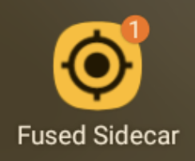
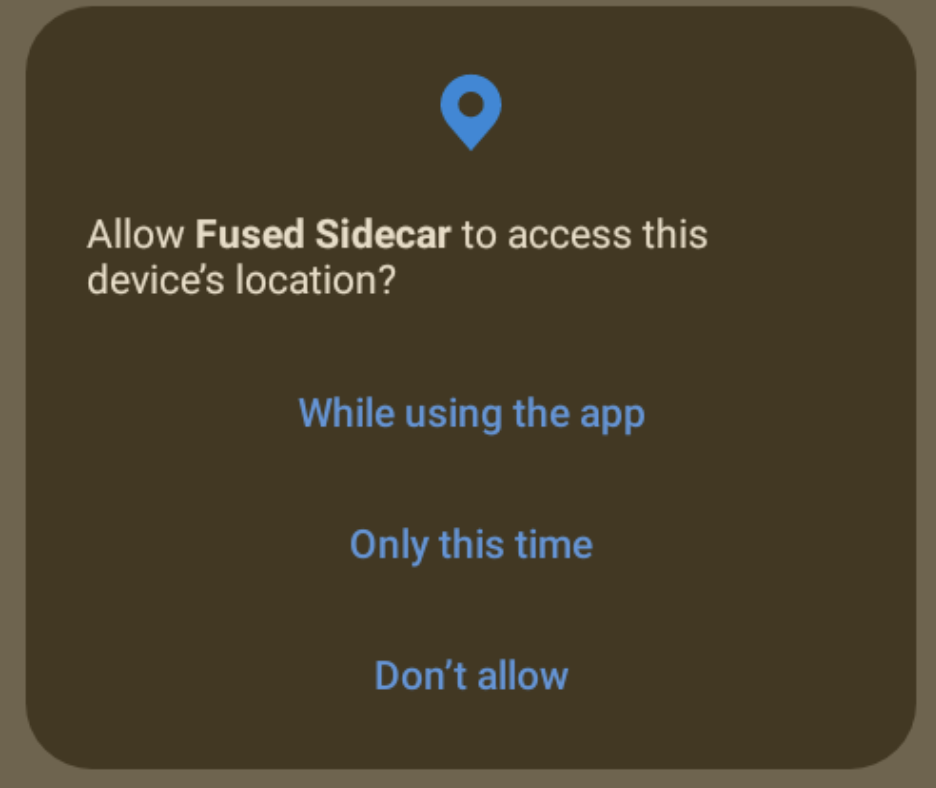
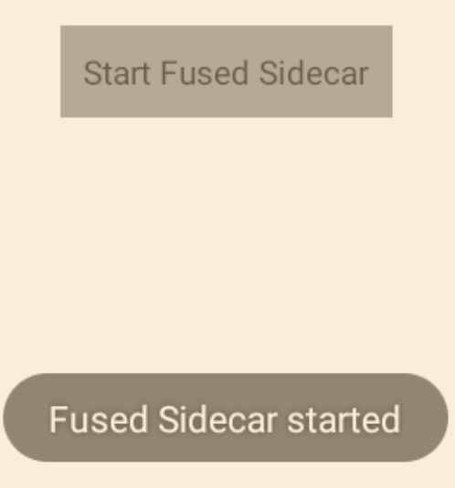
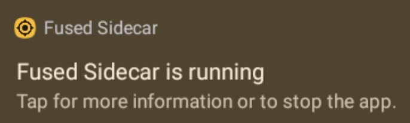
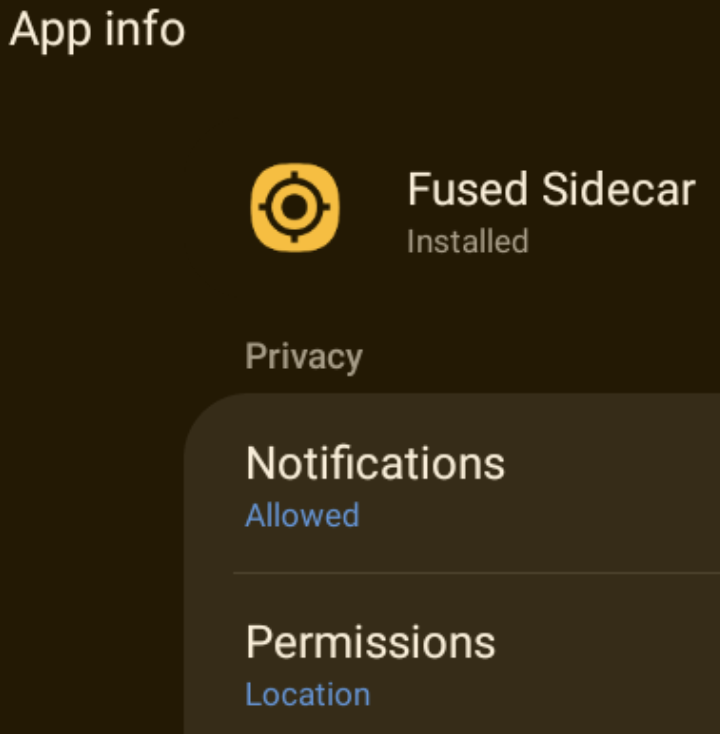
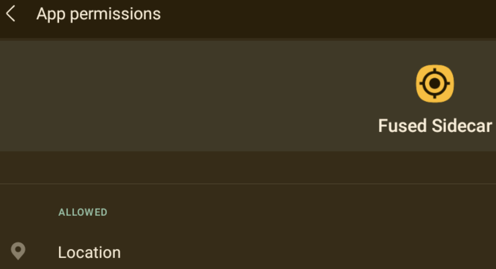
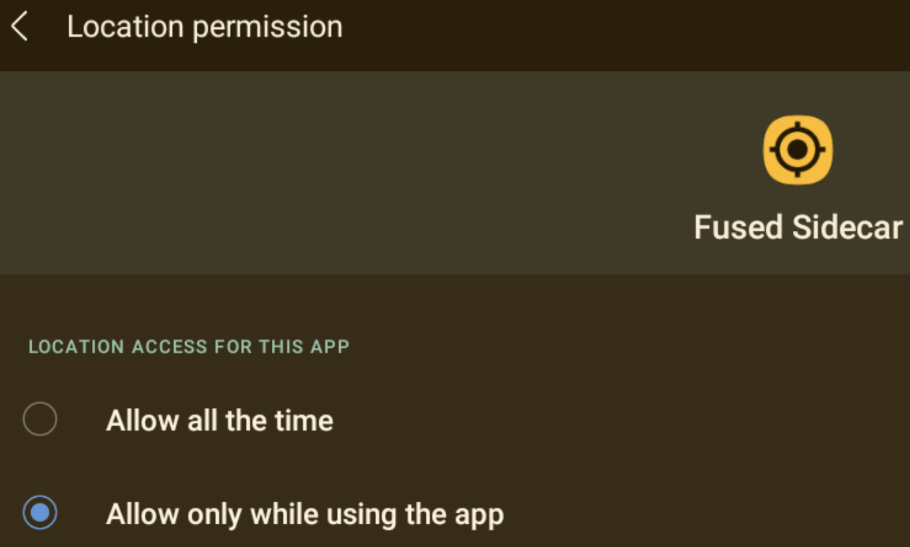
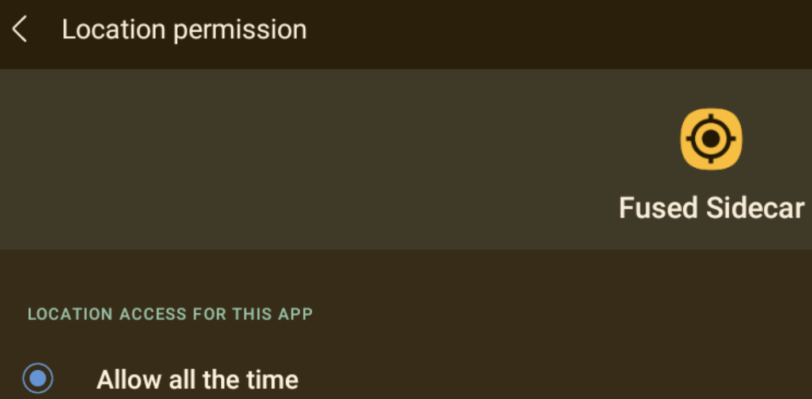

# Fused Sidecar App

Fused Sidecar App is a Fused Location Provider for the Android Team Awareness Kit (ATAK). Unlike the out-of-the-box GPS Location Provider that ATAK utilizes, Fused Sidecar App uses Google Play Services location, which fuses GPS, LTE, WiFi and Bluetooth positioning data. Using a fused location provider allows positioning in GPS denied environments, and can enhance positioning overall when combined with GPS (yes a reference is needed here).

## Install

1. Download & Install APK.
2. Start 'Fused Sidecar'.

### Screenshots

## Author
Greg Albrecht W2GMD <gba@undef.net>

## License
Apache License, Version 2.0